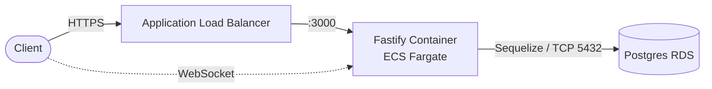

# opendispatch — High-Throughput Fastify & Postgres Fleet API

A high-throughput fleet dispatch API for tracking drivers and deliveries in real time. Built as a portfolio demo: Fastify backend, Postgres via Sequelize, JWT auth, live GPS telemetry over WebSockets, and OpenTofu-provisioned AWS infrastructure.

## Architecture



```
ALB (public subnets)  →  Fastify on ECS Fargate (private subnets)  →  Postgres RDS (private subnets)
```

## Key features

- **Clean modular architecture** — each domain (`auth`, `deliveries`, `telemetry`) has its own route, controller, and schema under `server/src/modules/`.
- **TypeBox JSON schemas** — request/response validation via `@fastify/type-provider-typebox` and `@sinclair/typebox`.
- **JWT auth** — `@fastify/jwt` + `@fastify/cookie` + `bcrypt`, httpOnly cookie session.
- **Real-time telemetry** — `@fastify/websocket` endpoint streaming mock GPS pings every 3s.
- **State-machine delivery status** — transition validation on `PENDING → IN_TRANSIT → DELIVERED`, with `CANCELLED` as a terminal state from either.
- **OpenTofu IaC** — VPC, ECS Fargate, RDS Postgres, and ALB defined in `infra/`.
- **Multi-stage Docker build** — `node:20-alpine` build + production runner stages in `server/Dockerfile`.

## Repo layout

```
opendispatch/
├── server/    # Fastify backend (see server/README.md)
└── infra/     # OpenTofu IaC (AWS VPC, ECS Fargate, RDS, ALB)
```

## Quick start

```bash
cd server
cp .env.example .env      # adjust DB_*/JWT_SECRET as needed
docker-compose up -d      # starts local Postgres 16 on 5432
npm install
npm run migrate            # syncs Sequelize models (User, Driver, Delivery) to the DB
npm run dev                 # starts Fastify on http://localhost:3000
```

Run the test suite and linter from `server/`:

```bash
npm test
npm run lint
```

### Endpoints

| Method | Path                        | Description                                 |
|--------|-----------------------------|----------------------------------------------|
| POST   | `/v1/auth/login`            | Login, sets httpOnly JWT cookie              |
| GET    | `/v1/deliveries`            | Paginated list, optional `?status=` filter   |
| POST   | `/v1/deliveries`            | Create a delivery (auto tracking number)     |
| PATCH  | `/v1/deliveries/:id/status` | Transition delivery status                   |
| GET    | `/v1/telemetry/ws`          | WebSocket: mock GPS pings every 3s           |

## Deploying infrastructure

```bash
cd infra
tofu init
tofu plan
tofu apply
```

See `infra/README.md` for the resources this provisions.